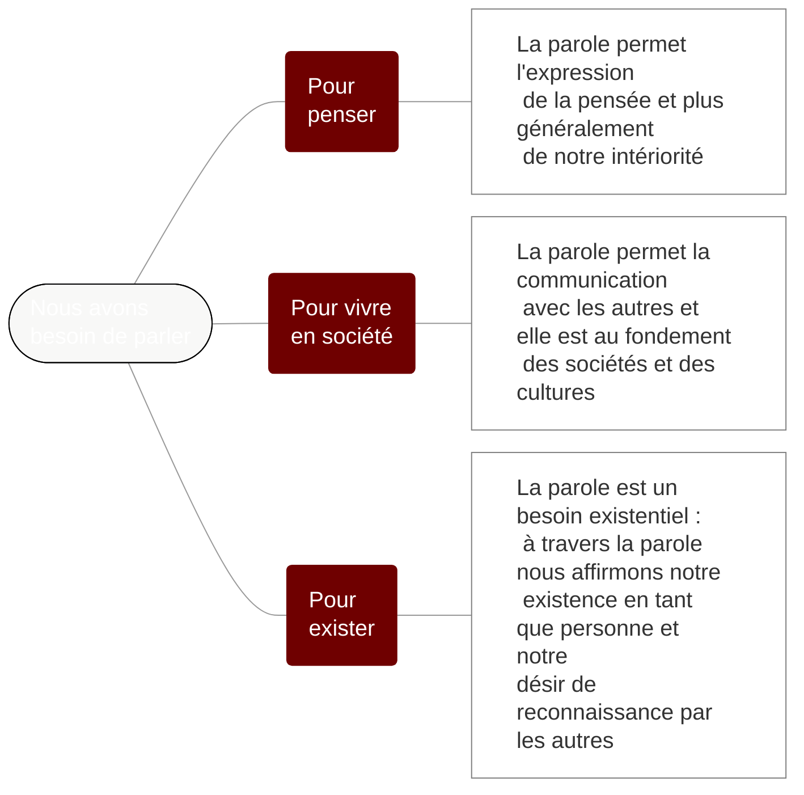

# Question 1 – Pourquoi parler est-il si important pour les êtres humains ?

## Mise en situation

Radicalisation de la question : Pourquoi avons-nous besoin de parler ? Travail par groupes de 4 pour essayer de répondre à cette question.

Les réponses sont notées au tableau. Exercice de regroupement de ces réponses en 2 ou 3 catégories

## Mise en forme

Trois grandes réponses sont distinguées :



```admonish abstract collapsible=true title="Afficher le texte de cette carte mentale"

Nous avons besoin de parler :

1. Pour penser : la parole permet l'expression de la pensée et plus généralement de notre intériorité
2. Pour vivre en société : la parole permet la communication avec les autres et elle est au fondement des sociétés et des cultures
3. Pour exister : la parole est un besoin existentiel : à travers la parole nous affirmons notre existence en tant que personne et notre désir de reconnaissance par les autres.

```

## Exercices

1. Classer une série de textes : quels sont les textes qui expriment l'importance de la parole pour penser, pour vivre en société, pour affirmer son existence ?
	- [Textes à classer](https://nuage03.apps.education.fr/index.php/s/fKLWCM5ACJmS3kf) (les textes avaient été préalablement découpées pour être mélangés)

2. Dans le texte d'Isocrate, retrouvez les trois dimensions de l'importance de la parole : parler pour penser, parler pour vivre en société, parler pour affirmer son existence
	- [Texte d'Isocrate](https://nuage03.apps.education.fr/index.php/s/YHH696PWxscy3bH)