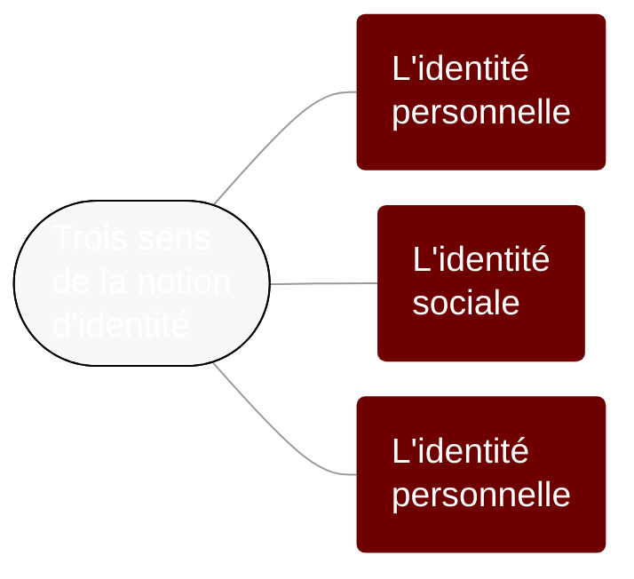

# Chapitre 1 : La parole révélatrice et constitutive de notre identité

Même si on ne cherche pas à parler explicitement de soi de manière intentionnelle, la parole révèle certains aspects de notre identité.

Trois sens de la notion d'identité


```admonish abstract collapsible=true title="Afficher le texte de cette carte mentale"

Trois sens de la notion d'identité :
1. L'identité personnelle
2. l'identité sociale
3. l'identité humaine

```


## Question 1 – Pourquoi parler est-il si important pour les êtres humains ?

### Mise en situation

Radicalisation de la question : Pourquoi avons-nous besoin de parler ? Travail par groupes de 4 pour essayer de répondre à cette question.

Les réponses sont notées au tableau. Exercice de regroupement de ces réponses en 2 ou 3 catégories

### Mise en forme

Trois grandes réponses sont distinguées :


```admonish abstract collapsible=true title="Afficher le texte de cette carte mentale"

Nous avons besoin de parler :

1. Pour penser : la parole permet l'expression de la pensée et plus généralement de notre intériorité
2. Pour vivre en société : la parole permet la communication avec les autres et elle est au fondement des sociétés et des cultures
3. Pour exister : la parole est un besoin existentiel : à travers la parole nous affirmons notre existence en tant que personne et notre désir de reconnaissance par les autres.

```

### Exercices

1. Classer une série de textes : quels sont les textes qui expriment l'importance de la parole pour penser, pour vivre en société, pour affirmer son existence ?
	- [Textes à classer](https://nuage03.apps.education.fr/index.php/s/fKLWCM5ACJmS3kf) (les textes avaient été préalablement découpées pour être mélangés)

2. Dans le texte d'Isocrate, retrouvez les trois dimensions de l'importance de la parole : parler pour penser, parler pour vivre en société, parler pour affirmer son existence
	- [Texte d'Isocrate](https://nuage03.apps.education.fr/index.php/s/YHH696PWxscy3bH)

## Question 2 – Comment la parole nous situe-t-elle socialement ?

### Mise en situation

Travail par groupes autour de 2 questions :
1. Trouver un maximum d’expressions pour dire “aller aux toilettes”. Qui dit ça ? Dans quel contexte ?
2. Quels sont les mots ou expressions que vous utilisez (avec vos amis, votre famille, …) et que d’autres personnes ne comprendraient pas (ou pas immédiatement) ?

### Mise en forme

#### Première approche de la sociolinguistique

Définition de la sociolinguistique
: La sociolinguistique est l’étude de la langue du point de vue sociologique. Elle s’intéresse aux variations dans l’usage d’une langue en fonction du contexte social.

Travail sur un [texte à propos de la sociolinguistique](https://nuage03.apps.education.fr/index.php/s/3L4THTsY45SxFyi).
1. Pourquoi la langue n’est-elle pas un simple instrument de communication ?
	- La langue n’est pas un outil qu’on utilise à un moment. Elle fait partie du quotidien. Nous baignons dans du langage
	- La langue n’est pas un objet extérieur, elle fait partie de notre identité, de notre intériorité (parfois nous jouons un rôle social et nous adoptons une manière de parler qui n’est pas vraiment la nôtre, nous sommes alors un peu extérieur à la manière dont nous parlons)
	- La langue n’est pas neutre. Elle exprime des valeurs et notre manière de parler est jugée par les autres. Exemple de la discrimination par l’accent. Cela peut conduire à une situation d’insécurité linguistique
2. Quelle est la position de Bourdieu sur le langage ?
	- Bourdieu affirme que la langue ne peut pas être comprise de manière abstraite. C’est avant tout une pratique sociale
	- À travers la langue, la structure sociale est présente. Un échange linguistique est aussi un rapport de forces symbolique et on peut l’analyser comme un échange économique : les discours sont évalués.

#### Carte mentale sur la notion de variations linguistiques

[](https://eyssette.github.io/mindmap/variations-linguistiques.html)

#### Deux fondateurs de la sociolinguistique : Labov et Bernstein

- [Les expériences de Labov](https://nuage03.apps.education.fr/index.php/s/FPEmkTPc8seJM2R)
- [Les discussions autour du travail de Bernstein](https://nuage03.apps.education.fr/index.php/s/7nWfKJtbJcaMoPD)

### Exercice

- Analyse d'un extrait du documentaire _Baisemain et Mocassins_ : [lien](https://drive.google.com/file/d/1mekwiTlJzmrMroH9K26U7szn66uXTXJF/view?usp=sharing)
	- Qu'est-ce qui dans la parole de cet adolescent révèle son appartenance à une classe sociale particulière ?

<!-- ## Question 3 – La parole exprime-t-elle mon identité ?

### Mise en situation

Discussion en groupes autour de 6 questions : 
1. Avez-vous un tatouage ou connaissez-vous quelqu'un qui a un tatouage ? Quelle est la signification de ce tatouage ? En quel sens un tatouage exprime-t-il l'identité de la personne ?
2. Votre prénom a-t-il une signification particulière ? Avez-vous un ou des surnoms ? De manière générale, dans quelle mesure un prénom ou un surnom manifestent-ils l'identité d'une personne ?
3. Dans quelles situations une personne peut-elle être amenée à utiliser un pseudonyme ? Pour quelles raisons ? Le pseudonyme dit-il quelque chose de nous ?
4. a/ Avez-vous créé un profil sur un réseau social ? Votre profil et vos publications sont-ils l'expression fidèle de qui vous êtes ? <br/>b/ Suivez-vous une personne publique sur un réseau social ? Quelle image cette personne donne-t-elle d'elle-même ?
5. Avez-vous déjà rédigé un CV, une lettre de motivation ? Quand on se présente pour un emploi, la manière dont on parle de soi est-elle un mensonge ?
6. a/ Peut-on deviner l'identité politique d'une personne ? Dans quelle mesure la manière de parler d'une personne révèle-t-elle ses positions politiques ? <br/>b/ Dans un discours politique, la personne qui parle doit-elle donner une certaine image d'elle-même ?

### Mise en forme

#### La notion d'_ethos_

Lecture d'un texte de Ruth Amossy sur la [notion d'ethos chez Aristote et Goffman](https://nuage03.apps.education.fr/index.php/s/ybKAGnipM9qG5op)
	- Qu'est-ce que l'ethos selon Aristote ?
	- Qu'est-ce que l'ethos selon Goffman ? -->