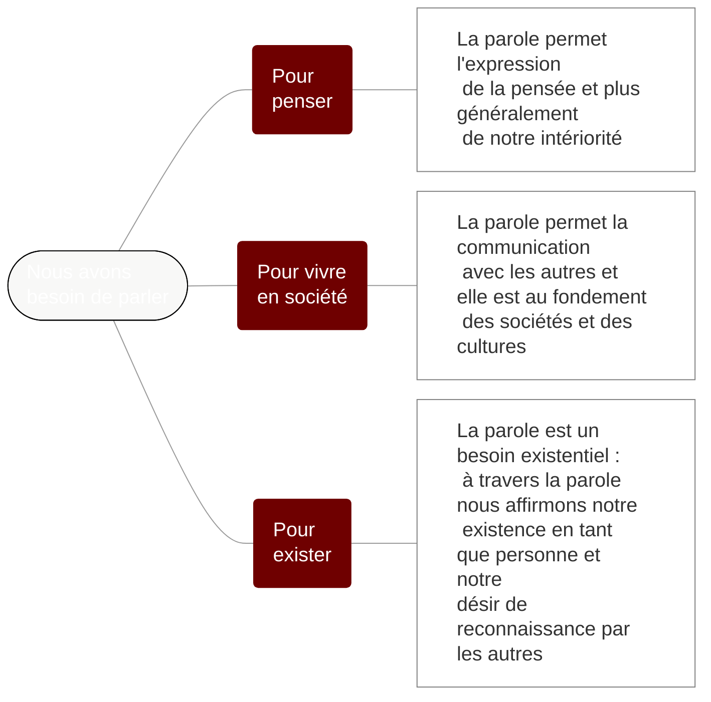

# Chapitre 1 : La parole révélatrice et constitutive de notre identité

Même si on ne cherche pas à parler explicitement de soi de manière intentionnelle, la parole révèle certains aspects de notre identité.

Trois sens de la notion d'identité


```admonish abstract collapsible=true title="Afficher le texte de cette carte mentale"

Trois sens de la notion d'identité :
1. L'identité personnelle
2. l'identité sociale
3. l'identité humaine

```


## Question 1 – Pourquoi parler est-il si important pour les êtres humains ?

De manière plus forte : « Pourquoi avons-nous besoin de parler ? ». Travail par groupes de 4 pour essayer de répondre à cette question.

Les réponses sont notées au tableau. Exercice de regroupement de ces réponses en 2 ou 3 catégories

Trois grandes réponses sont distinguées :



```admonish abstract collapsible=true title="Afficher le texte de cette carte mentale"

Nous avons besoin de parler :

1. Pour penser : la parole permet l'expression de la pensée et plus généralement de notre intériorité
2. Pour vivre en société : la parole permet la communication avec les autres et elle est au fondement des sociétés et des cultures
3. Pour exister : la parole est un besoin existentiel : à travers la parole nous affirmons notre existence en tant que personne et notre désir de reconnaissance par les autres.

```


### Documents distribués

- [Importance de la parole : exercice de classement de textes](https://nuage03.apps.education.fr/index.php/s/fKLWCM5ACJmS3kf)