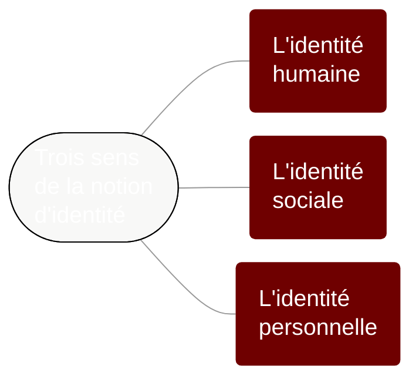

# Chapitre 1 : La parole révélatrice et constitutive de notre identité

Même si on ne cherche pas à parler explicitement de soi de manière intentionnelle, la parole révèle certains aspects de notre identité.

Trois sens de la notion d'identité


```admonish abstract collapsible=true title="Afficher le texte de cette carte mentale"

Trois sens de la notion d'identité :
1. L'identité humaine
2. l'identité sociale
3. l'identité personnelle

```

## Point méthode : construction d'un paragraphe argumentatif

Pour rédiger un paragraphe argumentatif, on peut suivre le modèle ARES :
- **A** : On formule son **A**rgument à partir de l'**A**nalyse des notions
- **R** : On utilise une **R**éférence théorique (auteur·e, courant de pensée, vocabulaire philosophique précis) pour approfondir son idée
- **E** : On montre la pertinence concrète de cette idée, à l'aide d'un **E**xemple
- **S** : On fait une **S**ynthèse de son argument et on formule une réponse explicite à la question posée

<style>table {font-size:0.8em;} table span {font-size:0.9em} td {text-align:left!important; padding:10px 20px!important;}</style>

## Contenu de ce chapitre

<script>subPages()</script>